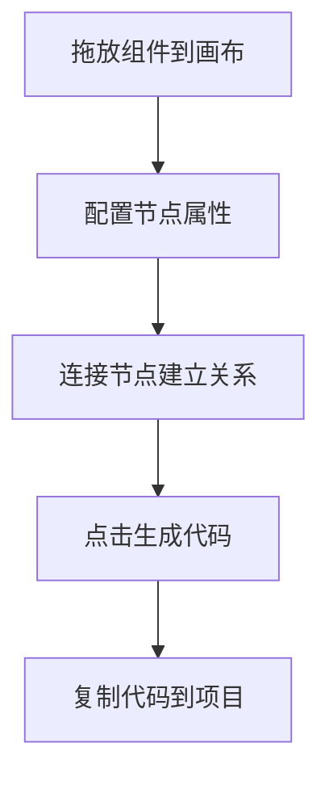

# OpenAI Agents 可视化工作流设计器

这是一个基于Web的可视化工作流设计工具，允许用户通过拖放的方式创建OpenAI Agents SDK工作流，然后生成对应的Python代码。

## 🚀 功能特点

- 拖放式组件设计界面
- 可视化连接节点建立关系
- 配置节点参数属性
- 自动生成OpenAI Agents SDK代码
- 支持Agent、Runner、Function Tool和Guardrail节点类型
- 高亮显示生成的Python代码

## 📋 技术栈

- **前端框架**: React 19+
- **状态管理**: Zustand
- **工作流编辑器**: React Flow
- **代码编辑器**: Monaco Editor
- **UI样式**: TailwindCSS
- **构建工具**: Vite + TypeScript

## 🛠️ 项目结构

```
src/
├── components/          # 组件目录
│   ├── Canvas/          # 画布相关组件
│   ├── Nodes/           # 节点组件
│   ├── Edges/           # 连接线组件
│   ├── Sidebar/         # 侧边栏组件
│   └── ConfigPanel/     # 配置面板组件
├── store/               # 状态管理
├── types/               # TypeScript类型定义
├── utils/               # 工具函数
│   └── codeGenerator.ts # 代码生成器
└── App.tsx              # 主应用组件
```

## 📦 节点类型

1. **Agent节点** - OpenAI Agents的核心组件
   - 配置name、instructions等属性
   - 可连接到其他Agent建立handoff关系
   - 可连接Function Tool获取工具能力

2. **Runner节点** - 执行Agent的运行器
   - 配置输入内容和执行模式(同步/异步)
   - 连接到Agent节点进行执行

3. **Function Tool节点** - 自定义工具函数
   - 定义参数和返回类型
   - 编写函数实现逻辑
   - 连接到Agent作为工具使用

4. **Guardrail节点** - 定义Agent的守护规则
   - 配置输出模型和守护函数
   - 连接到Agent实现输入验证

## 🚀 开始使用

1. 安装依赖
```bash
pnpm install
```

2. 启动开发服务器
```bash
pnpm dev
```

3. 构建生产版本
```bash
pnpm build
```

## 📝 使用方法

1. 从左侧组件面板拖放节点到画布
2. 点击节点进行配置，设置相关属性
3. 通过连接点建立节点之间的关系
4. 点击右上角的"生成代码"按钮查看生成的Python代码
5. 复制代码到你的项目中使用

## 📊 工作流程图



## 📄 示例代码

设计工具生成的代码示例：

```python
from agents import Agent, Runner
import asyncio
from agents import function_tool

@function_tool
def get_weather(city: str) -> str:
    return f"The weather in {city} is sunny."

agent = Agent(
    name="Helper",
    instructions="You are a helpful assistant.",
    tools=[get_weather]
)

async def main():
    result = await Runner.run(agent, "What's the weather in Tokyo?")
    print(result.final_output)

if __name__ == "__main__":
    asyncio.run(main())
```

## 📅 更新日志

### [1.0.0] - 2025-03-31
* 初始版本发布
* 支持基本的Agent、Runner、Function Tool和Guardrail节点
* 实现拖放式界面和代码生成功能
